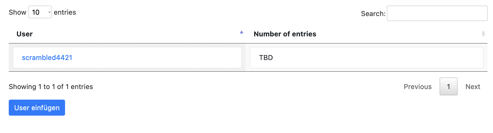
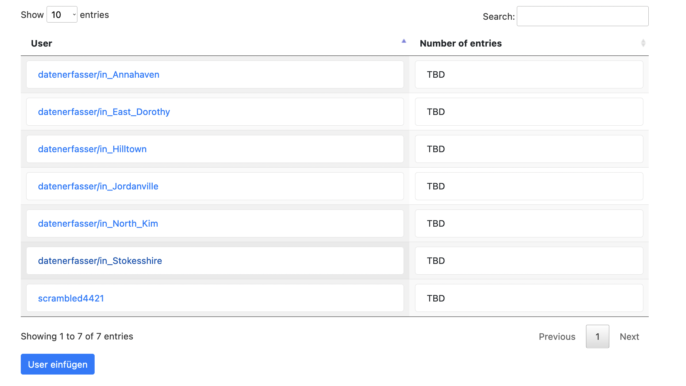
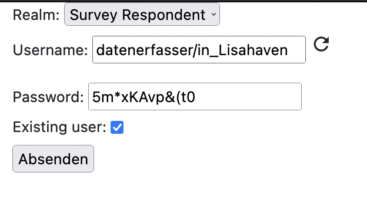
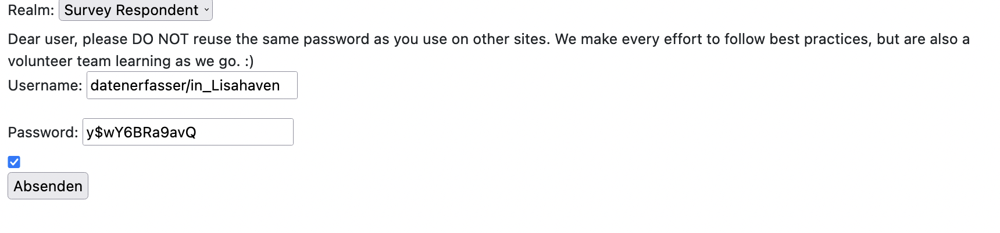

Current VIP: stolper.jstet.net

General information about the project to which this repository belongs can be found [here](https://pad.correlaid.org/zHZbVjb4TS6Vntt4XpnrBA?both).

For issues associated with the whole project take a look at [this](https://github.com/orgs/CorrelAid/projects/10)

# How do I run this locally?

You can run this locally, setting up the database the first time is the hardest part:

1. First, if you haven't already, install MongoDB: [https://docs.mongodb.com/manual/administration/install-community/](https://docs.mongodb.com/manual/administration/install-community/)
    > **_NOTE:_** For Arch Linux, install mongodb-bin from the AUR and see [this](https://askubuntu.com/questions/823288/mongodb-loads-but-breaks-returning-status-14) if you run into an error when executing mongod.
3. Start the server / MongoDB shell by running `mongod` on the command line
    > **_NOTE:_**  MongoDB actually doesn't create the database/document until an entry is inputted. So you don't have to do anything in the shell, although you could run `show dbs` later to verify the database was created. 
4. Create a .env file with the local `MONGODB_URI` in it along with the PORT you want to run the survey on `8080`, e.g.:
    ```
    touch .env
    echo "MONGODB_URI=localhost:27017" > .env
    echo "PORT=8080" >> .env
    echo "LOCAL=True" >> .env
    echo "USERNAME=scrambled4421" >> .env
    echo "PASSWORD=$2VseJ#bYmVPxu" >> .env
    ```
   > HINT: This username and password combo is simply for development. 
4. Install the python requirements (best to do in a virtual environment):
    ```
    pip install -r requirements.txt
    ```
5. Run main.py (`python main.py` on the command line)
6. Open up [0.0.0.0:8000](0.0.0.0:8080) in your web browser

# How is the data saved?

Example (null, True/False might be slightly inaccurate, will have to check):

   - Fertig: True or False, whether this entry has been completed and checked centrally
   - ID: albert_alexander_ro16 
   - Vorname: Jane
   - Nachname: Doe
   - URL: doe_family.html
   - Verlegejahr: 2010
   - Straße: Fakestraße
   - Hausnummer: 32
   - data:
       * 0 [an entry for each coding, first entry should be from scraping]
           * Final: False
           * Geschlecht: weiblich
           * Geburtsname: Brown
           * Akademischer_Titel: Dr.
           * Andere_Namen: null
           * PLZ: 88662
           * Opfergruppen: ["juedisch", "politisch"] 
           * Beruf: Bäckerin
           * Familie
               * 0
                  * Familienmitglied: Doe, John
                  * Verwandschaftsbeziehung: Mann
                  * ID: emma_adler_ne30
           * Geburtsjahr: 1910
           * Geburtsmonat: 8
           * Geburtstag: null
           * Geburtsdatum_vermutet: false
           * Geburtsort: Ulm
           * Geburtsort_vermutet: false
           * Todesjahr: 1942
           * Todesmonat: 2
           * Todestag: null
           * Todesdatum_vermutet: true
           * Todesort: KZ Example 2
           * Todesort_vermutet: false
           * Tod_in_Gefangenschaft: true
           * Flucht
                * 0
                    * Zielort: USA
                    * Durchgangsort:
                        * 0: Frankreich
                    * Erfolg: False
                    * Flucht_AF_Jahr: 1937
                    * Flucht_AF_Monat: 
                    * Flucht_Af_Tag: 
                    * Flucht_ED_Jahr: 
                    * Flucht_ED_Monat: 
                    * Flucht_ED_Tag: 22
           * Stationen
                * 0
                    * Ort: KZ Example 1
                    * ID:
                    * Stationen_AF_Jahr: 
                    * Stationen_AF_Monat: 
                    * Stationen_AF_Tag: 
                    * Stationen_ED_Jahr: 1941
                    * Stationen_ED_Monat: 
                    * Stationen_ED_Tag: 
                * 1
                    * Ort: KZ Example 2
                    * ID:
                    * Stationen_AF_Jahr: 1941
                    * Stationen_AF_Monat: 12
                    * Stationen_AF_Tag: 1
                    * Stationen_ED_Jahr: 1942
                    * Stationen_ED_Monat: 2
                    * Stationen_ED_Tag: 21
           * Ueberlebt: False
       
# User Management

1. Run the app (`main.py`)
2. Go to http://0.0.0.0:8080/admin/users (login if necessary with the credentials in .env)
3. You should be able to manage users there:

4. You can add many different users, random credentials will be generated:

5. If you didn't save the password, click on the user to reset their password (you won't be able to see their old password, so this is how you would do it if a person forgot their own password.)

6. Try logging in as a user, you should also be able to reset your password in a similar way:
